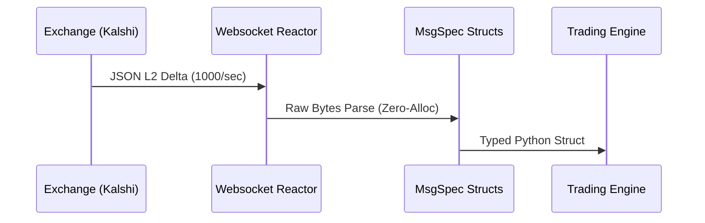

<div align="center">
  <h1>Prediction Market SDK</h1>
  <p><strong>Ultra-Low Latency Python SDK for Kalshi & Polymarket</strong></p>
  
  
</div>

## Architecture

This SDK strictly relies on `msgspec` to eliminate Python Garbage Collection (GC) pauses during high-frequency L2 Orderbook delta processing.



## Installation
```bash
pip install prediction-market-sdk
```

## Quickstart
```python
import asyncio
from prediction_market_sdk.ws import MarketWebsocket

async def handle_orderbook(delta):
    # Delta is a strongly-typed `msgspec` struct. No dict allocation.
    print(f"L2 Update: {delta.price}c | Vol: {delta.delta}")

ws = MarketWebsocket("wss://trading-api.kalshi.com/trade-api/v2/ws", handle_orderbook)
asyncio.run(ws.connect())
```
